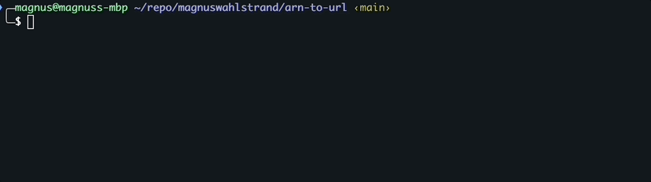

# ARN to URL

A simple tool that takes an ARN (Amazon Resource Names) and resolves the corresponding AWS Console URL. Outputs to
standard out, or opens the URL in the browser. Can be combined with other tools
like [fzf](https://github.com/junegunn/fzf) for scripting.



## Installation

```
go install github.com/magnuswahlstrand/arn-to-url
```

## Usage

Output to standard out - `arn-to-url`

```
> echo arn:aws:ecs:eu-west-1:0123456789:service/my-ecs-cluster/my-service | arn-to-url

https://eu-west-1.console.aws.amazon.com/ecs/v2/clusters/my-ecs-cluster/services/my-service
```

----------

Open in browser - `arn-to-url --web`

```
> echo arn:aws:ecs:eu-west-1:0123456789:service/my-ecs-cluster/my-service | arn-to-url --web

URL: https://eu-west-1.console.aws.amazon.com/ecs/v2/clusters/my-ecs-cluster/services/my-service
Opening in the browser...
```

-------

Go through SSO flow to account (via `https://magnus.awsapps.com/start`) and assume role `admin-permission@dev` in account `975049894820`.

`arn-to-url --web --domain magnus --roles 975049894820:admin-permission@dev`

```
> echo arn:aws:ecs:eu-west-1:0123456789:service/my-ecs-cluster/my-service | arn-to-url --web --domain magnus --roles 975049894820:admin-permission@dev

URL: https://eu-west-1.console.aws.amazon.com/ecs/v2/clusters/my-ecs-cluster/services/my-service
Opening in the browser...
```

## Supported services

| Service     | Resource Type | Supported |
|-------------|---------------|-----------|
| lambda      | function      | ✅         |
| ecs         | service       | ✅         |
| dynamodb    | table         | ✅         |
| s3          | *             | ✅         |
| sqs         | *             | ✅         |
| _all other_ | *             | ❌         |

## Options

```
Flags:
--version         Displays the program version string.
-h --help            Displays help with available flag, subcommand, and positional value parameters.
-w --web             Open URL(s) in the default browser (default standard out)
-e --ignore-errors   Ignore errors. Only opens or prints successfully resolved URLs
-d --domain          Access portal domain. E.g. 'magnus' for magnus.awsapps.com/start
-r --roles           Comma separated list of account to IAM role to assume. E.g. 12345:admin,54321:dev. NOTE: Only used if access portal domain is set. If skipped, you will be prompted to choose a role.
```

# Advanced usage

### One-liner with fzf

If you work with a single (or main) profile, you can do one-liner with `aws` and `fzf` list, select and open ARNs.

```
aws resourcegroupstaggingapi get-resources \
               --profile admin@dev \
               --no-cli-pager --query='ResourceTagMappingList[].ResourceARN'  \
               --resource-type-filter lambda:function ecs:service dynamodb:table s3 sqs \
               --output text | tr '\t' '\n' | \
               fzf | \
               arn-to-url
```

**Note:** "multi-lined" for readability 🤓

Output:

```
https://eu-west-1.console.aws.amazon.com/ecs/v2/clusters/my-ecs-cluster/services/my-service
```

### Scripting with fzf

```
# Select profile
AWS_PROFILE=$(aws configure list-profiles | sort | fzf --no-multi --no-preview --border --header="Select profile")

# List resources available to that profile
ARN=$(aws resourcegroupstaggingapi get-resources --profile $AWS_PROFILE --no-cli-pager --query='ResourceTagMappingList[].ResourceARN'  --resource-type-filter lambda:function ecs:service dynamodb:table s3 sqs --output text | tr '\t' '\n' |fzf)

# Output (or open) URL for selected ARN
echo $ARN | arn-to-url
```

Output:

```
https://eu-west-1.console.aws.amazon.com/ecs/v2/clusters/my-ecs-cluster/services/my-service
```